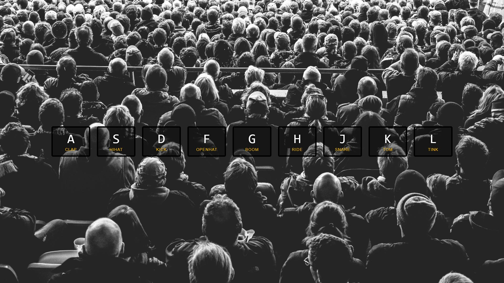

# Drumkit Web Application

Welcome to the Drumkit Web Application repository! This project is a fun, interactive drum kit that allows users to play drums using their keyboard or mouse clicks. Built with HTML, CSS, and JavaScript, this application is designed to be simple and enjoyable for users of all ages.


## Table of Contents

- [Features](#features)
- [Installation](#installation)
- [How to Use](#how-to-use)
- [Contributing](#contributing)
- [Contact](#contact)
- [License](#license)

## Features

- **Responsive Design:** Works on desktops, tablets, and mobile devices.
- **Keyboard Support:** Each drum can be played using specific keyboard keys.
- **Sound Effects:** Realistic drum sounds for each type of drum pad.
- **Animated Feedback:** Visual feedback when a drum is hit.

## Installation

To set up this project locally, follow these steps:

1. Clone the repository:
   ```bash
   git clone https://github.com/leulx1/Drumkit-using-JavaScript.git
   ```
2. Navigate to the project directory:
   ```bash
   cd drumkit
   ```
3. Open the `Home.html` file in your browser.

No additional installation is required, as all the dependencies are included within the project files.

## How to Use

Using the Drumkit is straightforward:

- **Keyboard Mode:**
  - Press the keys displayed on each drum pad to play the corresponding sound.

The interface is intuitive, with each drum pad labeled with the key that triggers it.

## Screenshoot



## Contributing

Contributions are what make the open source community such an amazing place to learn, inspire, and create. Any contributions you make are **greatly appreciated**.

If you have a suggestion that would make this better, please fork the repo and create a pull request. You can also simply open an issue with the tag "enhancement".
Don't forget to give the project a star! Thanks again!

1. Fork the Project
2. Create your Feature Branch (`git checkout -b feature/AmazingFeature`)
3. Commit your Changes (`git commit -m 'Add some AmazingFeature'`)
4. Push to the Branch (`git push origin feature/AmazingFeature`)
5. Open a Pull Request

### Contact

Email-[LeulTsehaye](leultsehaye123@gmail.com)

Github-[@leulx1](https://github.com/leulx1)

Project Link: https://github.com/leulx1/Drumkit-using-JavaScript.git

### Acknowledgments

First of all thankyou god, and Thanks for this wonderful website([freecodecamp](https://freecodecamp.org)) for giving me this wonderful project.
